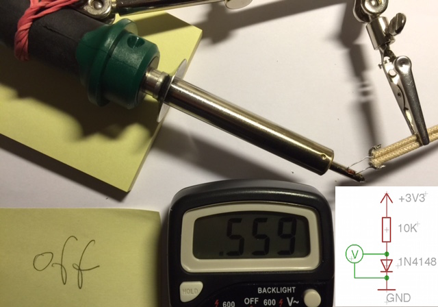

#1N4148 temperatur profile

######description

use the temperature effect of a diode to messure temperatures between 100 and 400°C

######circuit

+3.3v -- R 10KΩ -- heat resistant wire -- 1N4148 -- heat resistant wire -- GND

######use case

calibation off an solder ion without temp control but with a poti for fixed temperatue setting without display
	
######how

heating up the diode will decrease the internal resistance and the volatege drops

    source: http://thomaspfeifer.net/laminator_temperatur_regelung.htm

######solder ion is off

######round about 270°C

